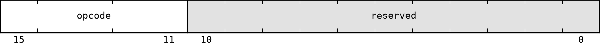

# A16 Instruction Formats

All A16 instructions are 16 bits wide. Bits are numbered from 15, the most significant bit, to 0, the least significant bit. The primary `opcode` always occupies bits `15:11`.

A format only defines the position and width of each encoded field. The definition of an instruction specifies how its register and immediate fields are used. Fields named `reserved` and any register or immediate bits not used by the selected instruction must be zero. An extension may assign a meaning to bits reserved by the base architecture.

## No operand (N)

Used by `NOP` and `RET`.

| Field | Bits | Description |
| --- | --- | --- |
| `opcode` | `15:11` | Primary opcode |
| `reserved` | `10:0` | Reserved bits |

## Register (R)

Used by instructions whose operands are all registers.

| Field | Bits | Description |
| --- | --- | --- |
| `opcode` | `15:11` | Primary opcode |
| `rd` | `10:8` | Register field, normally the destination |
| `rs1` | `7:5` | First source-register field |
| `rs2` | `4:2` | Second source-register field |
| `func` | `1:0` | Secondary operation selector |

For three-register operations, including `SLL`, `SRL`, and `SRA`, all register fields are used as named. `MOV` and `NOT` use `rd` and `rs1`. `CMP` uses `rs1` and `rs2`, and does not use `rd`. `JMPR`, `CALLR`, and `PUSH` use `rs1`; `POP` uses `rd`.

## Register-immediate (RI)

Used by `LI`, `LIH`, `ADDI`, `CMPI`, `ANDI`, `ORI`, and `XORI`.

| Field | Bits | Description |
| --- | --- | --- |
| `opcode` | `15:11` | Primary opcode |
| `rd` | `10:8` | Register field |
| `imm8` | `7:0` | Immediate field |

`LI` and `LIH` use `rd` as a destination. `ADDI`, `ANDI`, `ORI`, and `XORI` use it as both source and destination. `CMPI` uses the same field as a source register, interprets `imm8` as signed, and does not write a register. Each other instruction defines how `imm8` affects the operation.

## Register-register-immediate (RRI)

Used by immediate shift, load, and store instructions.

| Field | Bits | Description |
| --- | --- | --- |
| `opcode` | `15:11` | Primary opcode |
| `rd` | `10:8` | Register field, normally the destination |
| `rs` | `7:5` | Source or base-register field |
| `imm5` | `4:0` | Immediate field |

Immediate shift and load instructions use `rd` as the destination and `rs` as a source or base register. Store instructions use `rd` as the value source and `rs` as the base register. `SLLI`, `SRLI`, and `SRAI` store `shamt4` in bits `3:0`; bit `4` is unused. Memory instructions interpret the complete `imm5` field as a signed byte offset.

## Immediate (I)

Used by `JMP`, `CALL`, and conditional branches.

| Field | Bits | Description |
| --- | --- | --- |
| `opcode` | `15:11` | Primary opcode |
| `imm11` | `10:0` | Immediate field |

Control-flow instructions interpret `imm11` as a signed offset measured in instructions.

`opcode` and `func` assignments are listed in [04_instruction_encoding.md](04_instruction_encoding.md). The interpretation of every immediate field is defined in [02_instruction_set.md](02_instruction_set.md).
