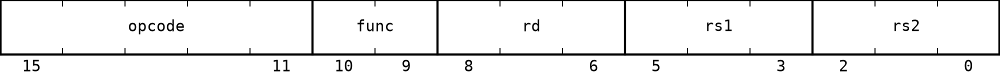
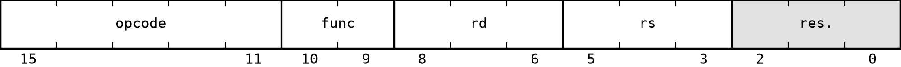
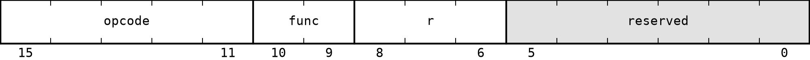
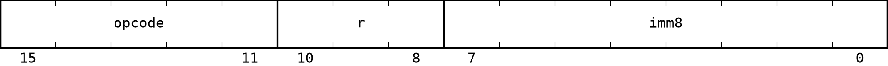
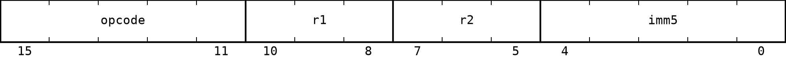
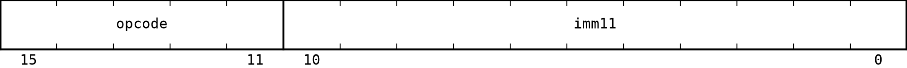

# A16 Instruction Formats

All A16 instructions are 16-bit wide. Bits are numbered from 15, the most significant bit, to 0, the least significant bit. The primary `opcode` always occupies bits `15:11`.

Fields named `reserved` must be zero in a canonical encoding.

## No operand

Used by `NOP` and `RET`.

| Field | Bits | Description |
| --- | --- | --- |
| `opcode` | `15:11` | Primary opcode |
| `reserved` | `10:0` | Reserved bits |

## Register-register-register (RRR)

Used by `ADD`, `SUB`, `AND`, `OR`, and `XOR`.

| Field | Bits | Description |
| --- | --- | --- |
| `opcode` | `15:11` | Primary opcode |
| `func` | `10:9` | Secondary operation selector |
| `rd` | `8:6` | Destination register |
| `rs1` | `5:3` | First source register |
| `rs2` | `2:0` | Second source register |

## Register-register (RR)

Used by `MOV`, `CMP`, and `NOT`.

| Field | Bits | Description |
| --- | --- | --- |
| `opcode` | `15:11` | Primary opcode |
| `func` | `10:9` | Secondary operation selector |
| `rd` | `8:6` | Destination or first operand register |
| `rs` | `5:3` | Source or second operand register |
| `reserved` | `2:0` | Reserved bits |

For `CMP`, `rd` is the first comparison operand and no register is written.

## Register (R)

Used by `JMPR`, `CALLR`, `PUSH`, and `POP`.

| Field | Bits | Description |
| --- | --- | --- |
| `opcode` | `15:11` | Primary opcode |
| `func` | `10:9` | Secondary operation selector |
| `r` | `8:6` | Register operand |
| `reserved` | `5:0` | Reserved bits |

For `JMPR`, `CALLR`, and `PUSH`, `r` is a source register. For `POP`, `r` is a destination register. The `111` encoding is illegal for `PUSH` and `POP` because both instructions modify `SP` implicitly.

## Register-immediate (RI)

Used by `LI`, `LIH`, `ADDI`, `SUBI`, and `CMPI`.

| Field | Bits | Description |
| --- | --- | --- |
| `opcode` | `15:11` | Primary opcode |
| `r` | `10:8` | Register operand |
| `imm8` | `7:0` | Immediate field |

For `LI` and `LIH`, `r` is the destination register. For `ADDI` and `SUBI`, it is both the source and destination. For `CMPI`, it is a source register and no register is written.

## Register-register-immediate (RRI)

Used by `SLL`, `SRL`, `SRA`, `LOAD`, and `STORE`.

| Field | Bits | Description |
| --- | --- | --- |
| `opcode` | `15:11` | Primary opcode |
| `r1` | `10:8` | First register operand |
| `r2` | `7:5` | Second register operand |
| `imm5` | `4:0` | Immediate field |

| Instructions | `r1` | `r2` | `imm5` |
| --- | --- | --- | --- |
| `SLL`, `SRL`, `SRA` | Destination | Source | Shift amount |
| `LOAD` | Destination | Base address | Data offset |
| `STORE` | Source data | Base address | Data offset |

## Immediate (I)

Used by `JMP`, `CALL`, `BRA`, `BEQ`, `BNE`, `BLT`, `BGE`, `BLTU`, and `BGEU`.

| Field | Bits | Description |
| --- | --- | --- |
| `opcode` | `15:11` | Primary opcode |
| `imm11` | `10:0` | Immediate field |

For `JMP` and `CALL`, `imm11` is an unsigned absolute instruction address. For relative branches, it is a signed offset from the instruction that follows the branch.

---

`opcode` and `func` assignments are listed in [04_instruction_encoding.md](04_instruction_encoding.md).
