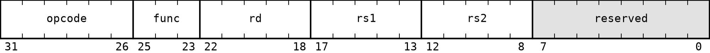
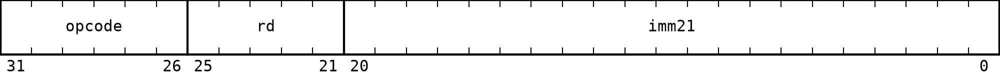
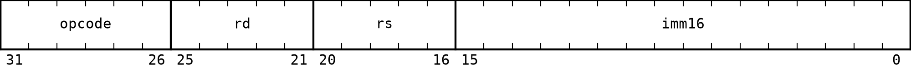
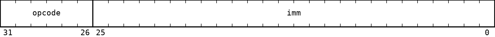

# A32 Instruction Formats

All A32 instructions are 32 bits wide. Bits are numbered from 31, the most significant bit, to 0, the least significant bit. The primary `opcode` always occupies bits `31:26`.

A format only defines the position and width of each encoded field. The definition of an instruction specifies how its register and immediate fields are used. Register fields and immediate bits not used by an instruction, along with fields named `reserved`, must be zero in a canonical encoding.

## Register (R)

Used by instructions whose operands are all registers.

| Field | Bits | Description |
| --- | --- | --- |
| `opcode` | `31:26` | Primary opcode |
| `func` | `25:23` | Secondary operation selector |
| `rd` | `22:18` | Register field, normally the destination |
| `rs1` | `17:13` | First source-register field |
| `rs2` | `12:8` | Second source-register field |
| `reserved` | `7:0` | Reserved bits |

For three-register operations, all register fields are used as named. `MOV` and `NOT` use `rd` and `rs1`. `CMP` uses `rs1` and `rs2`, and does not use `rd`. `JMPR`, `CALLR`, and `PUSH` use `rs1`; `POP` uses `rd`.

## Register-immediate (RI)

Used by `LI`, `LIH`, and `CMPI`.

| Field | Bits | Description |
| --- | --- | --- |
| `opcode` | `31:26` | Primary opcode |
| `rd` | `25:21` | Register field |
| `imm21` | `20:0` | Immediate field |

`LI` and `LIH` use `rd` as a destination. `CMPI` uses the same field as a source register and does not write a register. Each instruction defines which bits of `imm21` are meaningful and how they affect the operation.

## Register-register-immediate (RRI)

Used by arithmetic-immediate, logic-immediate, shift, load, and store instructions.

| Field | Bits | Description |
| --- | --- | --- |
| `opcode` | `31:26` | Primary opcode |
| `rd` | `25:21` | Register field, normally the destination |
| `rs` | `20:16` | Source or base-register field |
| `imm16` | `15:0` | Immediate field |

Arithmetic, logic, shift, and load instructions use `rd` as the destination and `rs` as a source or base register. Store instructions use `rd` as the value source and `rs` as the base register. Each instruction defines whether `imm16` is a numeric operand, shift amount, or memory offset and how it is extended.

## Immediate (I)

Used by `JMP`, `CALL`, conditional branches, `NOP`, and `RET`.

| Field | Bits | Description |
| --- | --- | --- |
| `opcode` | `31:26` | Primary opcode |
| `imm26` | `25:0` | Immediate field |

Control-flow instructions interpret `imm26` as a signed offset measured in instructions. `NOP` and `RET` do not use the immediate, so `imm26` must be zero in their canonical encodings.

`opcode` and `func` assignments are listed in [04_instruction_encoding.md](04_instruction_encoding.md). The interpretation of every immediate field is defined in [02_instruction_set.md](02_instruction_set.md).
