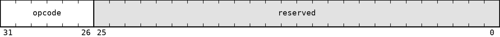
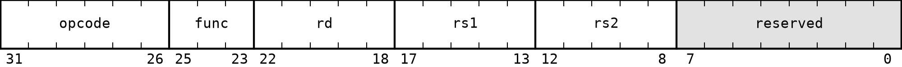
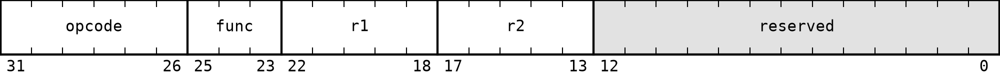

# A32 Instruction Formats

All A32 instructions are 32 bits wide. Bits are numbered from 31, the most significant bit, to 0, the least significant bit. The primary `opcode` always occupies bits `31:26`.

Fields named `reserved` must be zero in a canonical encoding. The `func` field is three bits wide and selects one operation within an opcode group.

## No operand

Used by `NOP` and `RET`.

| Field | Bits | Description |
| --- | --- | --- |
| `opcode` | `31:26` | Primary opcode |
| `reserved` | `25:0` | Reserved bits |

## Register-register-register (RRR)

Used by `ADD`, `SUB`, `AND`, `OR`, and `XOR`.

| Field | Bits | Description |
| --- | --- | --- |
| `opcode` | `31:26` | Primary opcode |
| `func` | `25:23` | Secondary operation selector |
| `rd` | `22:18` | Destination register |
| `rs1` | `17:13` | First source register |
| `rs2` | `12:8` | Second source register |
| `reserved` | `7:0` | Reserved bits |

## Register-register (RR)

Used by `MOV`, `CMP`, and `NOT`.

| Field | Bits | Description |
| --- | --- | --- |
| `opcode` | `31:26` | Primary opcode |
| `func` | `25:23` | Secondary operation selector |
| `rd` or `rs1` | `22:18` | Destination or first operand register |
| `rs` or `rs2` | `17:13` | Source or second operand register |
| `reserved` | `12:0` | Reserved bits |

For `CMP`, both register fields are sources and no register is written.

## Register (R)

Used by `JMPR`, `CALLR`, `PUSH`, and `POP`.

| Field | Bits | Description |
| --- | --- | --- |
| `opcode` | `31:26` | Primary opcode |
| `func` | `25:23` | Secondary operation selector |
| `r` | `22:18` | Register operand |
| `reserved` | `17:0` | Reserved bits |

For `JMPR`, `CALLR`, and `PUSH`, `r` is a source register. For `POP`, `r` is a destination register. Encoding `11111` is illegal for `PUSH` and `POP` because both instructions modify `SP` implicitly.

## Register-immediate (RI)

Used by `LI`, `LIH`, and `CMPI`.

| Field | Bits | Description |
| --- | --- | --- |
| `opcode` | `31:26` | Primary opcode |
| `func` | `25:23` | Secondary operation selector |
| `r` | `22:18` | Register operand |
| `reserved` | `17:16` | Reserved bits |
| `imm16` | `15:0` | Immediate field |

For `LI` and `LIH`, `r` is the destination register. For `CMPI`, it is a source register and no register is written.

## Register-register-immediate (RRI)

Used by `SLL`, `SRL`, `SRA`, `ADDI`, `SUBI`, `LDW`, `STW`, `LDB`, and `STB`.

| Field | Bits | Description |
| --- | --- | --- |
| `opcode` | `31:26` | Primary opcode |
| `r1` | `25:21` | First register operand |
| `r2` | `20:16` | Second register operand |
| `imm16` | `15:0` | Immediate field |

| Instructions | `r1` | `r2` | `imm16` |
| --- | --- | --- | --- |
| `ADDI`, `SUBI` | Destination | Source | Immediate value |
| `SLL`, `SRL`, `SRA` | Destination | Source | Shift amount |
| `LDW`, `LDB` | Destination | Base address | Byte offset |
| `STW`, `STB` | Source data | Base address | Byte offset |

Shift instructions accept values from `0` to `31`. Their `imm16` field therefore has bits `15:5` cleared and stores the shift amount in bits `4:0`.

## Immediate (I)

Used by `JMP`, `CALL`, `BEQ`, `BNE`, `BLT`, `BGE`, `BLTU`, and `BGEU`.

| Field | Bits | Description |
| --- | --- | --- |
| `opcode` | `31:26` | Primary opcode |
| `imm26` | `25:0` | Immediate field |

For `JMP`, `CALL`, and conditional branches, `imm26` is a signed offset measured in instructions from the instruction that follows the control-flow instruction. The encoded value is shifted left by two when added to `PC`.

`opcode` and `func` assignments are listed in [04_instruction_encoding.md](04_instruction_encoding.md).
