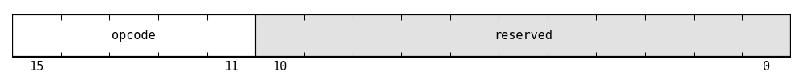
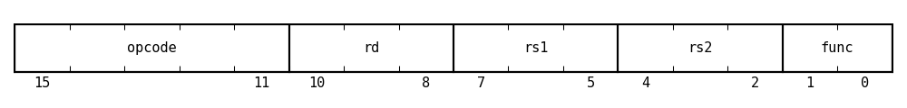
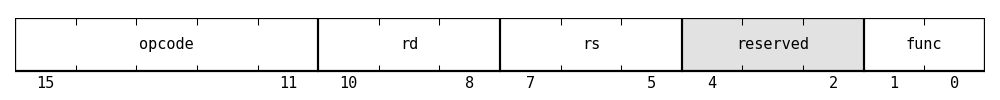
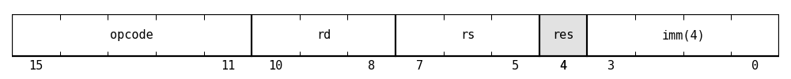
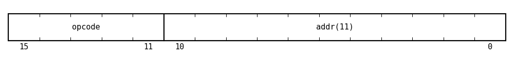
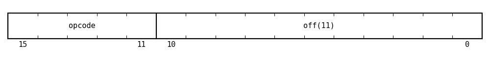
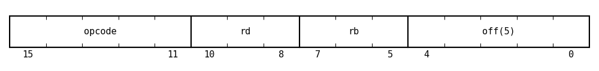
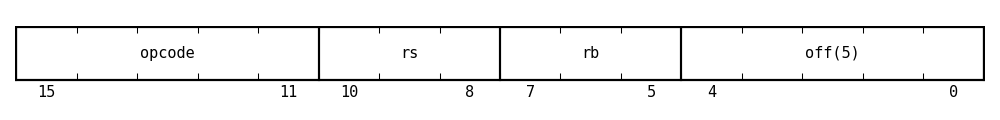

# AthenISA Instruction Formats

All AthenISA instructions are 16 bits wide. Depending on the instruction, the encoded fields may represent registers, immediates, absolute addresses, or relative offsets.

### No-operand

`NOP`, `RET`

| Field | Bits | Description |
| --- | --- | --- |
| `opcode` | `15:11` | Primary opcode |
| `reserved` | `10:0` | Reserved bits, should be encoded as zero by assemblers |

### Register-register-register (RRR)

`ADD`, `SUB`, `AND`, `OR`, `XOR`

| Field | Bits | Description |
| --- | --- | --- |
| `opcode` | `15:11` | Primary opcode |
| `rd` | `10:8` | Destination register |
| `rs1` | `7:5` | First source register |
| `rs2` | `4:2` | Second source register |
| `func` | `1:0` | Secondary function selector |

### Register-register (RR)

`MOV`, `NOT`, `CMP`

| Field | Bits | Description |
| --- | --- | --- |
| `opcode` | `15:11` | Primary opcode |
| `rd` | `10:8` | Destination or first operand register |
| `rs` | `7:5` | Source or second operand register |
| `reserved` | `4:2` | Reserved bits, should be encoded as zero by assemblers |
| `func` | `1:0` | Secondary function selector |

### Register-immediate (RI)

`LI`, `LIH`, `ADDI`, `SUBI`, `CMPI`

| Field | Bits | Description |
| --- | --- | --- |
| `opcode` | `15:11` | Primary opcode |
| `rd` | `10:8` | Destination or operand register |
| `imm(8)` | `7:0` | 8-bit immediate |

### Register-register-immediate (RRI)

`SLL`, `SRL`, `SRA`

| Field | Bits | Description |
| --- | --- | --- |
| `opcode` | `15:11` | Primary opcode |
| `rd` | `10:8` | Destination register |
| `rs` | `7:5` | Source register |
| `reserved` | `4` | Reserved bit, should be encoded as zero by assemblers |
| `imm(4)` | `3:0` | 4-bit shift amount |

> [!NOTE]
> A 4-bit shift immediate is sufficient for a 16-bit architecture because meaningful shift amounts range from 0 to 15.

### Unconditional jump

`JMP`, `CALL`

| Field | Bits | Description |
| --- | --- | --- |
| `opcode` | `15:11` | Primary opcode |
| `addr(11)` | `10:0` | Absolute 11-bit instruction address |

> [!NOTE]
> The 11 bits available for the absolute instruction address constrain instruction memory to `2^11` words. This ensures that an absolute jump can reach any instruction in memory.

### Conditional branch

`BEQ`, `BNE`, `BLT`, `BGT`, `BLE`, `BGE`

| Field | Bits | Description |
| --- | --- | --- |
| `opcode` | `15:11` | Primary opcode |
| `off(11)` | `10:0` | Signed 11-bit PC-relative offset |

> [!NOTE]
> Conditional branch targets are computed relative to `PC + 1`.

### Load

`LOAD`

| Field | Bits | Description |
| --- | --- | --- |
| `opcode` | `15:11` | Primary opcode |
| `rd` | `10:8` | Destination register |
| `rb` | `7:5` | Base register |
| `off(5)` | `4:0` | Signed 5-bit offset |

### Store

`STORE`

| Field | Bits | Description |
| --- | --- | --- |
| `opcode` | `15:11` | Primary opcode |
| `rs` | `10:8` | Source data register |
| `rb` | `7:5` | Base register |
| `off(5)` | `4:0` | Signed 5-bit offset |