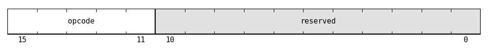
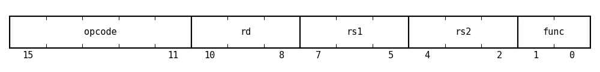
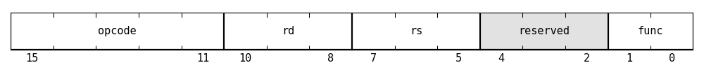
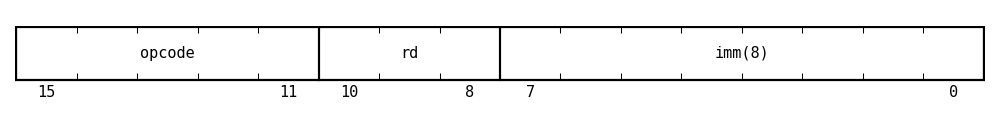
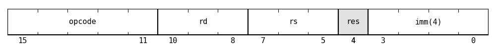
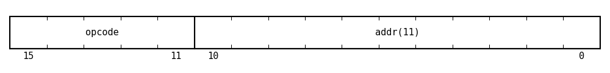
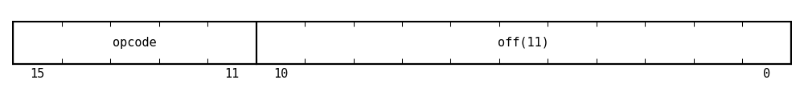
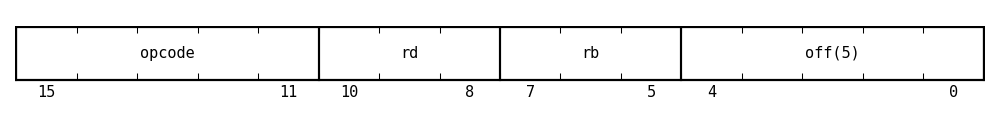
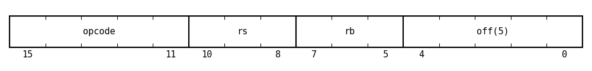

# AthenISA Instruction Formats

All AthenISA instructions are 16-bit wide. Bits are numbered from 15, the
most significant bit, to 0, the least significant bit. The primary `opcode`
always occupies bits `15:11`.

Fields named `reserved` must be zero in a canonical encoding.

## No operand

Used by `NOP` and `RET`.

| Field | Bits | Description |
| --- | --- | --- |
| `opcode` | `15:11` | Primary opcode |
| `reserved` | `10:0` | Reserved bits |

## Register-register-register (RRR)

Used by `ADD`, `SUB`, `AND`, `OR`, and `XOR`.

| Field | Bits | Description |
| --- | --- | --- |
| `opcode` | `15:11` | Primary opcode |
| `rd` | `10:8` | Destination register |
| `rs1` | `7:5` | First source register |
| `rs2` | `4:2` | Second source register |
| `func` | `1:0` | Secondary operation selector |

## Register-register (RR)

Used by `MOV`, `CMP`, and `NOT`.

| Field | Bits | Description |
| --- | --- | --- |
| `opcode` | `15:11` | Primary opcode |
| `rd` | `10:8` | Destination or first operand register |
| `rs` | `7:5` | Source or second operand register |
| `reserved` | `4:2` | Reserved bits |
| `func` | `1:0` | Secondary operation selector |

For `CMP`, `rd` is the first comparison operand and no register is written.

## Register-immediate (RI)

Used by `LI`, `LIH`, `ADDI`, `SUBI`, and `CMPI`.

| Field | Bits | Description |
| --- | --- | --- |
| `opcode` | `15:11` | Primary opcode |
| `rd` | `10:8` | Destination or first operand register |
| `imm8` | `7:0` | Unsigned 8-bit immediate |

## Register-register-immediate (RRI)

Used by `SLL`, `SRL`, and `SRA`.

| Field | Bits | Description |
| --- | --- | --- |
| `opcode` | `15:11` | Primary opcode |
| `rd` | `10:8` | Destination register |
| `rs` | `7:5` | Source register |
| `reserved` | `4` | Reserved bits |
| `imm4` | `3:0` | Shift amount |

## Absolute jump

Used by `JMP` and `CALL`.

| Field | Bits | Description |
| --- | --- | --- |
| `opcode` | `15:11` | Primary opcode |
| `addr11` | `10:0` | Absolute instruction address |

The field spans the complete 2048-word instruction address space.

## Conditional branch

Used by `BEQ`, `BNE`, `BLT`, `BGT`, `BLE`, and `BGE`.

| Field | Bits | Description |
| --- | --- | --- |
| `opcode` | `15:11` | Primary opcode |
| `off11` | `10:0` | PC-relative instruction offset |

A taken branch targets `PC + 1 + sext(off11)`.

## Load

Used by `LOAD`.

| Field | Bits | Description |
| --- | --- | --- |
| `opcode` | `15:11` | Primary opcode |
| `rd` | `10:8` | Destination register |
| `rb` | `7:5` | Base-address register |
| `off5` | `4:0` | Data offset |

## Store

Used by `STORE`.

| Field | Bits | Description |
| --- | --- | --- |
| `opcode` | `15:11` | Primary opcode |
| `rs` | `10:8` | Source data register |
| `rb` | `7:5` | Base-address register |
| `off5` | `4:0` | Data offset |

Opcode and `func` assignments are listed in
[04_instruction_encoding.md](04_instruction_encoding.md).
